# Low-Level Design (LLD): User Payout Management System

## 1. Project Overview
**Problem Statement:** The system manages user payouts for affiliate sales. It handles the lifecycle of a sale from `PENDING` to `APPROVED` or `REJECTED`, disburses a 10% advance payout on pending sales, calculates final payouts post-reconciliation, enforces withdrawal limits (1 per 24 hours), and handles the recovery of failed withdrawals.
**Overall Architecture:** A monolithic Service-Oriented Architecture (SOA) built in Node.js, utilizing a strict Controller-Service-Repository pattern.
**Main Backend Workflow:**
1. Sales are ingested as `PENDING`.
2. An admin triggers an Advance Payout job (via API) paying out 10%.
3. An admin reconciles sales (Approved/Rejected), triggering final payouts or debt recovery.
4. Users initiate withdrawals, which are processed by a simulated mock gateway.
**Technology Stack:** Node.js, Express.js, PostgreSQL, Prisma ORM, Zod (Validation), Pino (Logging).
**Folder Organization:** Domain-driven modular architecture (`src/modules/<domain>`).

---

## 2. Functional Requirements
**Implemented Functional Requirements:**
- **Advance Payout:** Eligible pending sales receive a 10% advance payout.
- **Final Payout Calculation:** Approved sales disburse `Earnings - Advance Paid`.
- **Debt Recovery (Rejection):** Rejected sales claw back the advance paid. If wallet balance is insufficient, the remainder is carried forward as a pending debt.
- **Withdrawal:** Users can withdraw available wallet balance.
- **Cooldown:** Only one withdrawal is permitted per 24 hours.
- **Failed Payout Recovery:** Failed withdrawals refund the wallet and immediately reset the 24-hour cooldown.

**Business Rules:**
- A single sale can strictly receive only ONE advance payout.
- Wallet balances cannot drop below zero.

**Assumptions Implemented:**
- The Advance Payout is triggered explicitly via an Admin API endpoint rather than a background cron job (simplifying state management for the assignment).
- Debt recovery is handled via a `pendingRecoveryPaise` field that intercepts future incoming credits.

---


## 6. Class Design (Service Layer)
*(Implemented via static object exports in JavaScript, acting as Singletons)*

- **saleService:** 
  - *Dependencies:* Prisma
  - *Public Methods:* `createSale`, `reconcileSale`, `getSalesByUser`, `getAllSales`
  - *Responsibilities:* Manages sale creation and the complex approval/rejection logic (handling final credits and debt adjustments).
- **payoutService:**
  - *Dependencies:* Prisma
  - *Public Methods:* `processAdvancePayouts`, `getPayoutHistory`
  - *Responsibilities:* Batches pending sales, calculates the 10% advance, intercepts active debt via `pendingRecoveryPaise`, and credits wallets.
- **withdrawalService:**
  - *Dependencies:* Prisma, MockPaymentGateway
  - *Public Methods:* `initiateWithdrawal`, `updateWithdrawalStatus`, `resetCooldown`
  - *Responsibilities:* Enforces 24h limit, debits wallet, dispatches mock network call, handles success/failure compensations.

---

## 7. Sequence Diagrams
*(See Section 15 for Mermaid Diagrams)*

---

## 8. State Diagrams
*(See Section 15 for Mermaid Diagrams)*

---

## 9. API Documentation

- **`POST /api/v1/sales`**
  - *Purpose:* Create a pending sale.
  - *Body:* `{ userId: UUID, brand: string, earningPaise: number }`
  - *Response:* `201 Created`
- **`PATCH /api/v1/sales/:id/reconcile`**
  - *Purpose:* Approve or reject a sale.
  - *Body:* `{ status: "APPROVED" | "REJECTED" }`
  - *Response:* `200 OK` (Errors: `400` if already reconciled).
- **`POST /api/v1/payouts/advance`**
  - *Purpose:* Trigger advance payouts.
  - *Body:* `{ userId?: UUID }` (Optional filter)
  - *Response:* `200 OK` with processed batch stats.
- **`GET /api/v1/payouts/:userId`**
  - *Purpose:* Fetch wallet balance and transaction ledger.
  - *Response:* `200 OK`
- **`POST /api/v1/withdrawals`**
  - *Purpose:* Initiate withdrawal to bank.
  - *Body:* `{ userId: UUID, amountPaise: number, forceStatus?: string }`
  - *Response:* `201` (Success) or `200` (Failed/Refunded). Errors: `429` (Cooldown), `400` (Insufficient funds).

---

## 10. Folder Structure
```text
backend/
├── prisma/
│   └── schema.prisma         # Database schema
├── src/
│   ├── config/               # Environment & logger setup
│   ├── middlewares/          # Global Zod & Error handlers
│   ├── modules/              # Domain-driven features
│   │   ├── payout/
│   │   ├── sale/
│   │   ├── user/
│   │   └── withdrawal/
│   ├── utils/                # Mock Gateway & Shared logic
│   ├── app.js                # Express app configuration
│   └── server.js             # Entry point
```
**Decision:** Module-based structure (Domain-Driven) ensures high cohesion. Grouping routes, controllers, and services by domain (e.g., `sale/`) makes microservice extraction trivial in the future.

---

## 11. Design Decisions
- **Why PostgreSQL & Prisma:** Strict relational requirements and ACID transactions are paramount for financial ledgers. Prisma provides type-safe DB access.
- **Why BigInt:** Prevents floating point errors common in JS (`0.1 + 0.2`). All currency is stored in `paise` (cents).
- **Why Service Layer:** Decouples business logic from HTTP transport, making logic testable via unit tests without mocking Express `req/res`.
- **Why WalletTransaction (Ledger):** While `Wallet.balancePaise` provides `O(1)` reads for current balance, financial systems require an immutable, append-only ledger for auditability.
- **Why `pendingRecoveryPaise`:** Rather than letting wallet balances go negative (which breaks standard withdrawal invariants), unrecoverable clawbacks are deferred as "debt" to be intercepted automatically from future payouts.

---

## 12. Error Handling
- **Validation:** Zod intercepts bad payloads at the middleware layer (400 Bad Request).
- **Idempotency/Race Conditions:** Prisma `$transaction` ensures that if a sale status changes mid-flight, the transaction rolls back gracefully.
- **Payment Failures:** Network/Gateway failures are caught by the service, triggering a compensating internal `$transaction` to refund the wallet and log a `WITHDRAWAL_REFUND`.
- **Cooldown Failures:** Handled by explicit Date diffing returning `429 Too Many Requests`.

---

## 13. Edge Cases Handled
- **The "Clawback Debt" Case:** User receives ₹10 advance, withdraws it, balance hits ₹0. Sale is Rejected. Code handles this by attempting a partial drain, failing, and shifting the ₹10 to `pendingRecoveryPaise` atomically.
- **Interception Case:** User has ₹10 debt. System generates ₹15 advance for a new sale. Code intercepts ₹10 (`RECOVERY_DEDUCTION`), reduces debt to ₹0, and credits wallet with ₹5 atomically.
- **Double Triggering:** Admin clicks "Advance Payout" twice instantly. `isAdvancePaid` boolean filter in the Prisma `where` clause naturally excludes sales already picked up by the first transaction block.

---

## 14. Future Improvements
- **BullMQ / Background Jobs:** Move the Advance Payout logic from a synchronous API trigger to a Redis-backed BullMQ cron job. Benefits: Automatic retries, decoupling from HTTP timeout limits, and scaling workers horizontally.
- **Distributed Locking:** While Prisma handles Row-Level Locking, using Redis (Redlock) for distributed locks on `userId` during payouts guarantees absolute safety in multi-instance horizontal scaling.
- **Webhooks:** Replace the synchronous Mock Gateway wait with an asynchronous Webhook architecture. Benefits: Real-time status updates without tying up Express worker threads.

---
---

## 15. Mermaid Diagrams

### Architecture Diagram
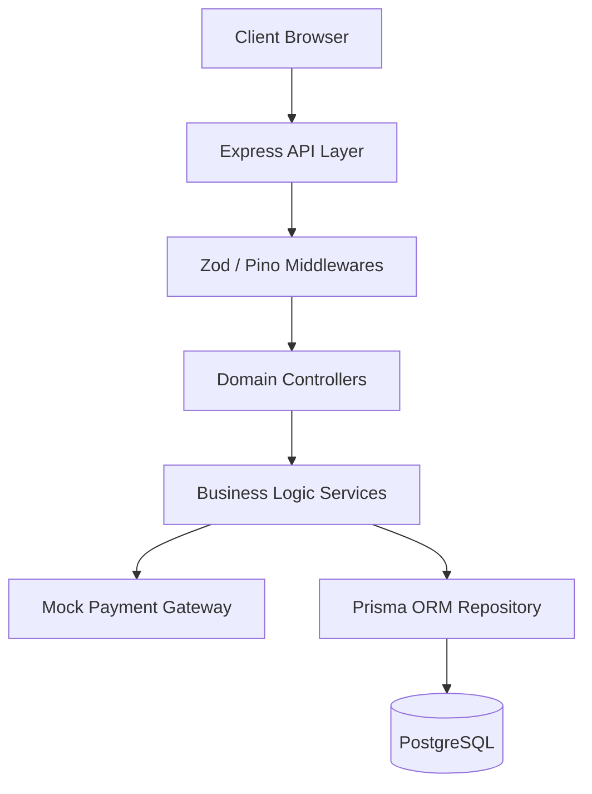

### ER Diagram
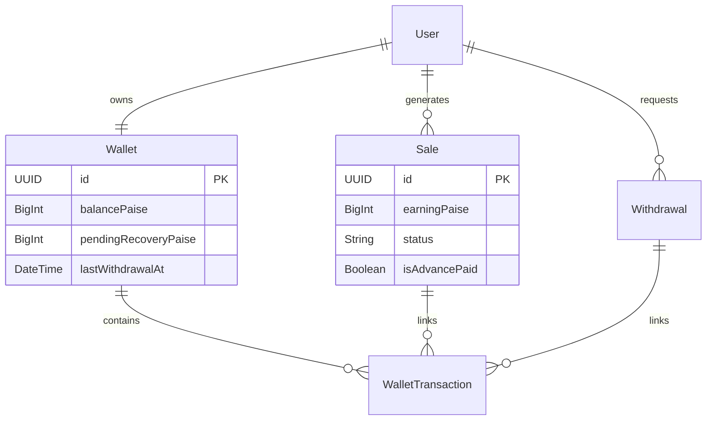

### Class Diagram (Service Layer)
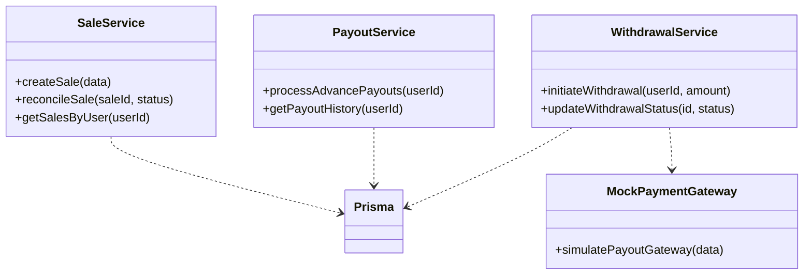

### Sequence Diagram - Sale Creation
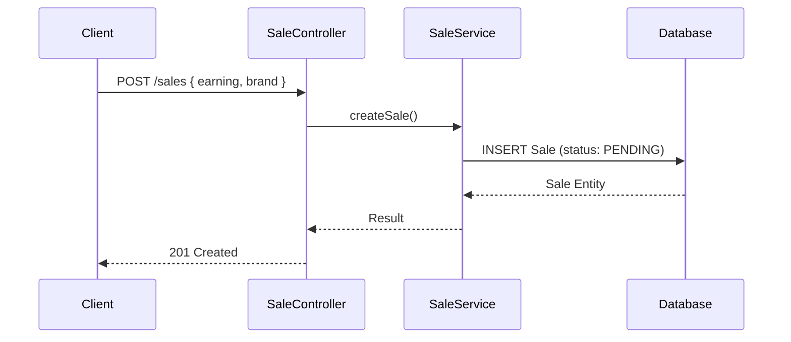

### Sequence Diagram - Advance Payout
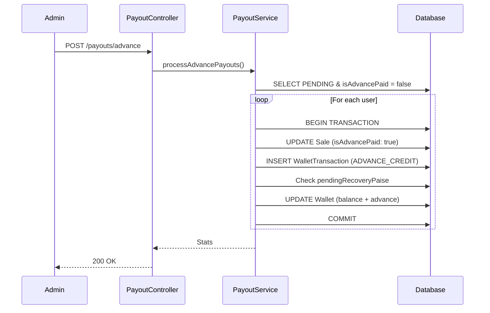

### Sequence Diagram - Approved Reconciliation
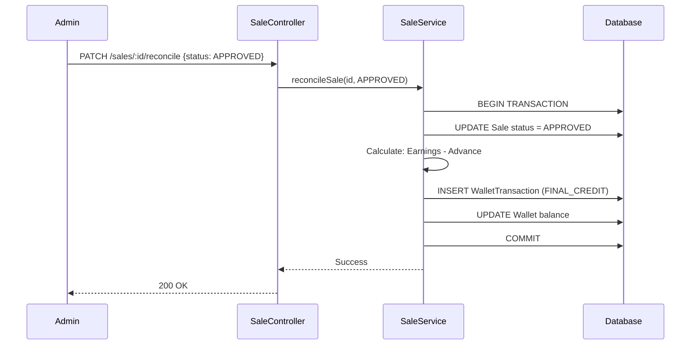

### Sequence Diagram - Rejected Reconciliation (With Debt Carry Forward)
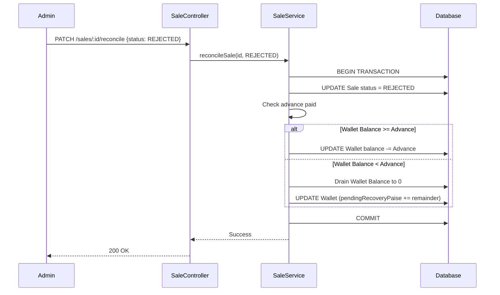

### Sequence Diagram - Withdrawal Success
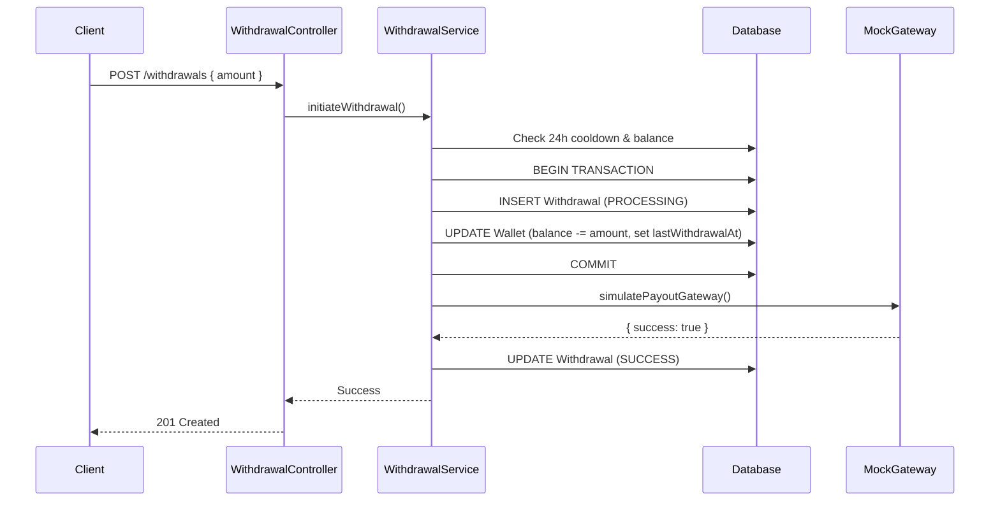

### Sequence Diagram - Withdrawal Failure
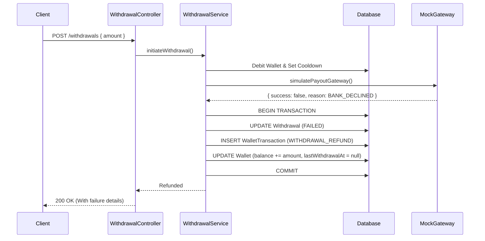

### State Diagram - Sale
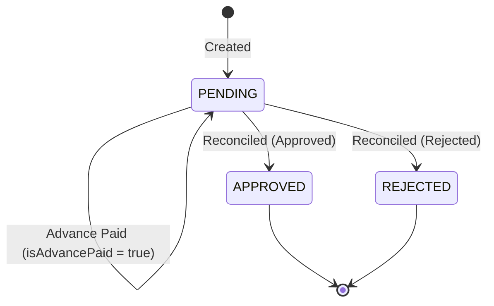

### State Diagram - Withdrawal
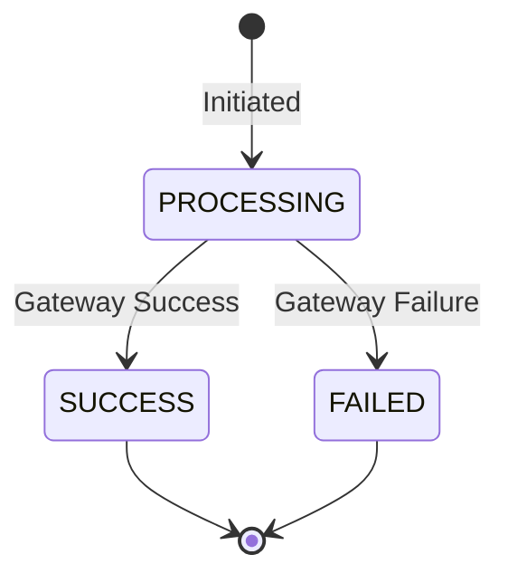
