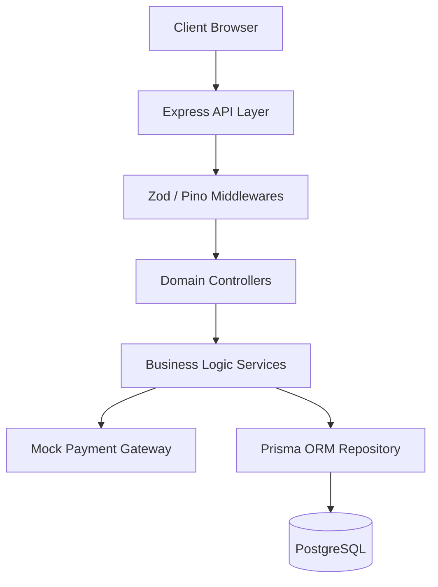
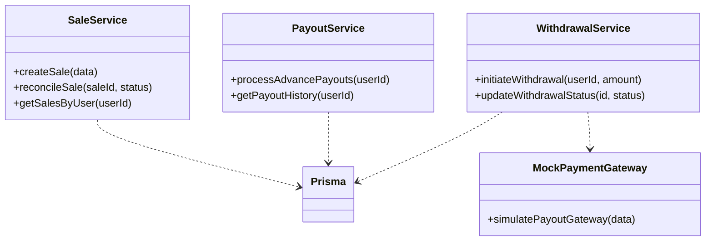
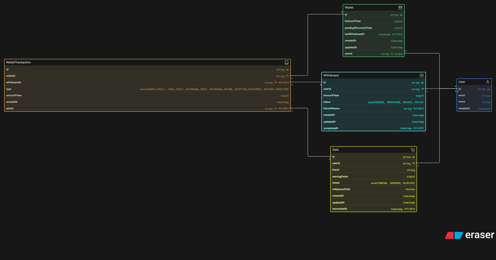

# Payout Management System

This repository contains a full-stack implementation of a highly resilient, financial-grade **User Payout Management System**. The backend is designed with distributed systems principles, ensuring exactly-once processing guarantees, strict ACID compliance, and robust compensating transaction flows.

## Getting Started

### Method 1: Using Docker (Recommended)
Run the entire full-stack application (Database, Backend, Frontend) via Docker Compose:

```bash
docker-compose up --build
```

### Method 2: Manual Setup (Without Docker)
If you prefer not to use Docker, ensure you have Node.js (v20+) and PostgreSQL installed.

**1. Database & Backend Setup**
```bash
cd backend
pnpm install
# Set DATABASE_URL in .env to your local PostgreSQL instance
npx prisma db push
pnpm run start
```
*Backend will run on http://localhost:8080*

**2. Frontend Setup**
```bash
cd frontend
pnpm install
pnpm run dev
```
*Frontend will run on http://localhost:3000.*

---

## 1. System Architecture

The system follows a strict **Service-Oriented Architecture (SOA)** using the Controller-Service-Repository pattern to decouple HTTP transport logic from core domain logic.



### Class Design (Service Layer)
The backend uses a singleton-based Service layer to orchestrate complex database operations. By isolating business rules in services, the system remains highly testable and agnostic to the underlying Express framework.



---

## 2. Er diagram

The database is normalized for strict financial auditing. We explicitly avoid floating-point math by storing all currency as `BigInt` (paise) to prevent IEEE 754 precision loss common in V8/Node.js.



### Key Schema Decisions
- **`WalletTransaction` (Event Sourced Ledger)**: While `Wallet.balancePaise` provides `O(1)` read access for real-time balances, true financial systems require an append-only ledger for absolute auditability. The `WalletTransaction` table guarantees that every balance mutation can be deterministically replayed and verified.
- **`pendingRecoveryPaise` (Deferred Debt)**: A critical invariant of the wallet is that `balancePaise >= 0`. Rather than breaking this invariant when a rejected sale triggers a clawback, the system safely records unrecoverable debt in `pendingRecoveryPaise`. Future incoming credits are automatically intercepted and routed to pay off this debt before reaching the liquid balance.

---

## 3. Assumptions & Design Constraints

1. **Synchronous Gateway Simulation**: To simplify deployment for this assignment, the payment gateway is simulated synchronously within the worker thread. In a real-world scenario, this would be an asynchronous Webhook-based architecture (e.g., Stripe/Razorpay callbacks).
2. **Batch Advance Trigger**: The advance payout process is designed to be triggered explicitly via an Admin API endpoint. This avoids the complexity of background Cron processes running on multiple clustered Node.js instances without a distributed lock (like Redlock), which could lead to race conditions in a stateless deployment.
3. **Internal Consistency Over Availability**: When external systems fail, the system prioritizes rolling back internal state (compensating transactions) over forcing retries, keeping the ledger perfectly consistent at the cost of immediate availability.

---

## 4. Concurrency Control & Failure Compensation

This system is built to handle race conditions, concurrent requests, and network partitions gracefully.

### A. Exactly-Once Processing (Idempotency)
When processing advance payouts across thousands of rows, the system must guarantee that a sale never receives a double payout. 
**Implementation**: We utilize Prisma's `$transaction` API for absolute atomicity. By leveraging `isAdvancePaid` as an idempotency flag within the SQL `WHERE` clause, the database inherently rejects concurrent requests that attempt to process the same sale twice. Row-level locking ensures that if two instances attempt to read and write the same sale simultaneously, the second transaction is safely dropped or rolled back.

### B. The "Clawback" Debt Interception
When an admin rejects a sale, the system must recover the advance paid.
**Implementation**: If a user has already withdrawn their funds and their balance is ₹0, deducting the advance would result in a negative balance. The `SaleService` detects this dynamically. It partially drains the wallet to `0` and atomically shifts the remaining liability into `pendingRecoveryPaise`. During the *next* payout cycle, the `PayoutService` intercepts the incoming credit, pays off the debt, and releases only the remainder to the user's liquid balance.

### C. Compensating Transactions (Saga-Lite Pattern)
Users can withdraw their available balance (strictly limited to 1 request per 24 hours). The withdrawal requires a network call to an abstracted Mock Payment Gateway.
**Implementation**: We enforce a "2-Phase Commit" style workflow. 
1. **Phase 1**: The wallet is immediately debited, and a `PROCESSING` withdrawal record is locked in the database via an ACID transaction.
2. **Phase 2**: The network call is dispatched.
3. **Compensation**: If the bank declines the request or the network times out, the `WithdrawalService` executes a **compensating transaction** to rollback the state. It writes a `WITHDRAWAL_REFUND` to the ledger, restores the wallet balance, and explicitly clears the 24-hour lockout timer—ensuring the user is not punished for an upstream network failure.

---

## 5. API Endpoints

| Method | Endpoint | Description |
|--------|----------|-------------|
| `POST` | `/api/v1/sales` | Create a new pending sale |
| `PATCH`| `/api/v1/sales/:id/reconcile` | Reconcile a sale (Approve/Reject) |
| `POST` | `/api/v1/payouts/advance` | Trigger the batch advance payout job |
| `GET`  | `/api/v1/payouts/:userId` | Get user wallet and transaction ledger |
| `POST` | `/api/v1/withdrawals` | Initiate a withdrawal to bank account |
