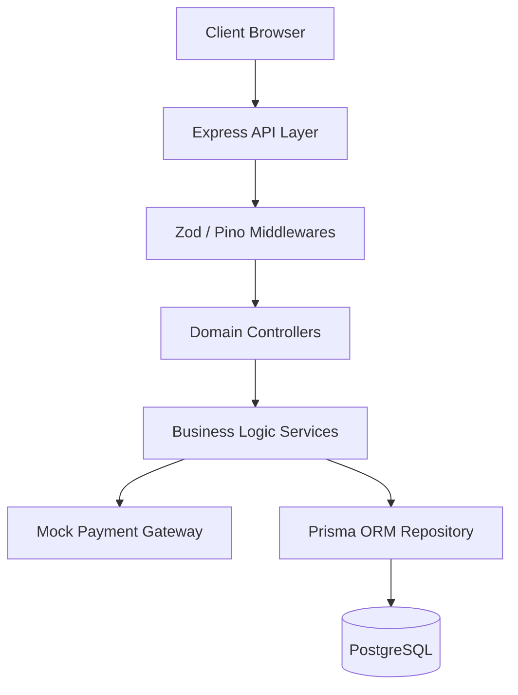
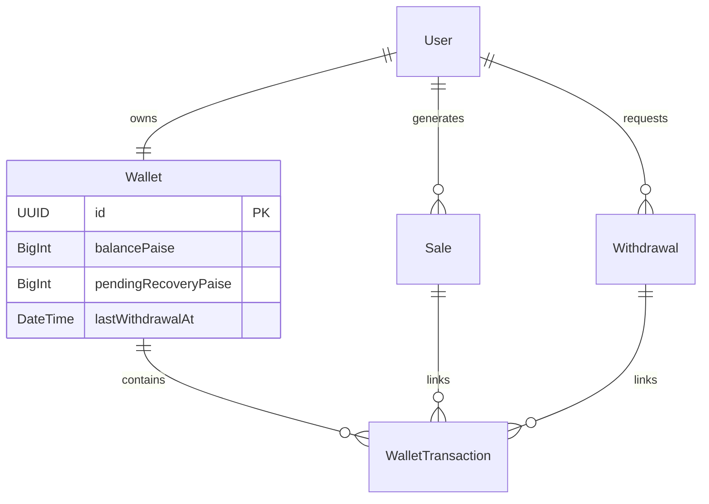

# Payout Management System

This repository contains a full-stack implementation of a highly resilient **User Payout Management System** that handles affiliate sales, advance payouts, reconciliation, and deferred debt recovery.

## 🚀 Getting Started

Run the entire full-stack application (Database, Backend, Frontend) via Docker Compose:

```bash
docker-compose up --build
```
- **Frontend Dashboard**: http://localhost:3001
- **Backend API**: http://localhost:3000

---

## 1. System Architecture

The system follows a strict **Service-Oriented Architecture (SOA)** using the Controller-Service-Repository pattern.



### Folder Structure (Backend)
```text
backend/
├── prisma/schema.prisma      # Database schema
├── src/
│   ├── config/               # Environment & logger setup
│   ├── middlewares/          # Global Zod & Error handlers
│   ├── modules/              # Domain-driven features (payout, sale, withdrawal)
│   ├── utils/                # Mock Gateway & Shared logic
```

---

## 2. Database & Ledger Design

The database is normalized for strict financial auditing. We use `BigInt` (paise) for all financial calculations to prevent floating-point precision loss.



### Key Schema Decisions
- **`WalletTransaction` (Immutable Ledger)**: While `Wallet.balancePaise` provides `O(1)` reads, financial systems require an append-only ledger for auditability.
- **`pendingRecoveryPaise` (Deferred Debt)**: Rather than letting wallet balances drop into the negative when a sale is rejected, the system records unrecoverable debt here. Future payouts are automatically deducted to pay off this debt.

---

## 3. Core Workflows & Edge Cases Handled

### A. Advance Payouts & Double Payout Protection
Eligible pending sales receive a 10% advance payout. 
**Edge Case Handled (Race Conditions):** Handled via Prisma `$transaction`. If multiple admins trigger the Advance Payout job at the exact same millisecond, row-level locking and the `isAdvancePaid` flag prevent a single sale from ever receiving two advances.

### B. Reconciliation & The "Clawback"
When a sale is Rejected, the system must recover the advance paid.
**Edge Case Handled (Negative Balance Prevention):** If a user withdraws their advance before the sale is rejected, the wallet might have ₹0. The system will never result in a `-₹10` balance. Instead, it drains the wallet to `0` and adds `₹10` to `pendingRecoveryPaise`. The next time the user makes a sale, the system intercepts the payout to recover this debt first.

### C. Withdrawals & Gateway Failures
Users can withdraw their available balance (limited to 1 per 24 hours). The withdrawal connects to an abstracted Mock Payment Gateway.
**Edge Case Handled (Timeout/Bank Decline):** If the bank declines the withdrawal *after* the wallet was debited, the system safely catches the failure, writes a `WITHDRAWAL_REFUND` to the ledger (restoring funds), and resets the 24-hour lockout timer so the user isn't punished.

---

## 4. API Endpoints

| Method | Endpoint | Description |
|--------|----------|-------------|
| `POST` | `/api/v1/sales` | Create a new pending sale |
| `PATCH`| `/api/v1/sales/:id/reconcile` | Reconcile a sale (Approve/Reject) |
| `POST` | `/api/v1/payouts/advance` | Trigger the batch advance payout job |
| `GET`  | `/api/v1/payouts/:userId` | Get user wallet and transaction ledger |
| `POST` | `/api/v1/withdrawals` | Initiate a withdrawal to bank account |

---

## 5. Future Improvements
- **BullMQ:** Move the Advance Payout logic from a synchronous API trigger to a Redis-backed background job for automatic retries and decoupling.
- **Distributed Locking:** Use Redis (Redlock) for distributed locks on `userId` during payouts to guarantee absolute safety in multi-instance horizontal scaling.
- **Webhooks:** Replace the synchronous Mock Gateway wait with an asynchronous Webhook architecture to prevent tying up Express worker threads.
